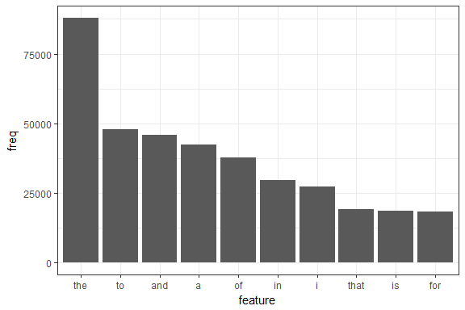
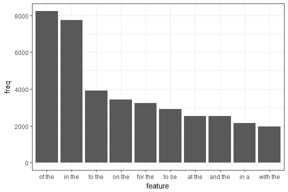
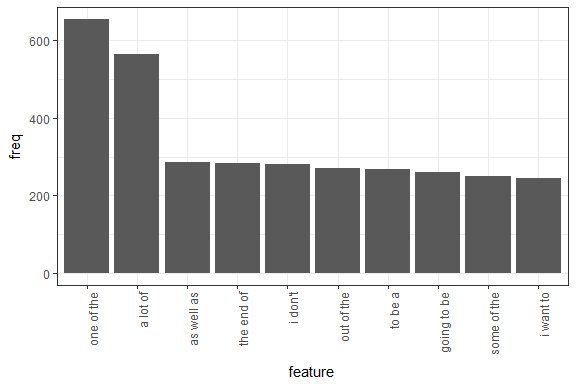
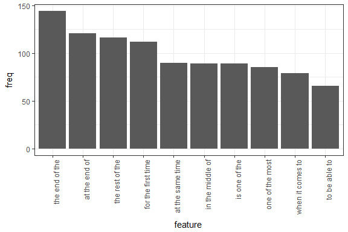
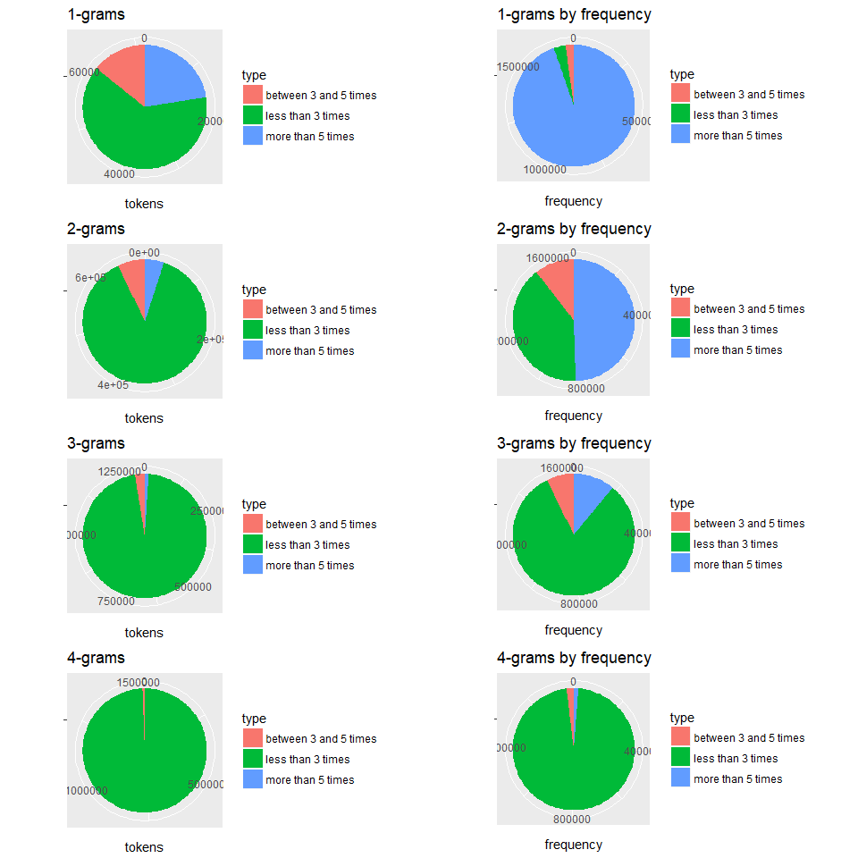

*Title: Capstone milestone report - word forecasting*

*Author: Jose Montero*

*Date: May 10th, 2018*

### 0.Executive summary

The aim of this report is to perform an exploratory analysis of the datasets provided for the Capstone project, and present the basics for the eventual app and algorithm that predicts the next word when writing.

### 1.Load libraries and data
First of all it is needed to load the needed packages and the data (downloaded once from https://d396qusza40orc.cloudfront.net/dsscapstone/dataset/Coursera-SwiftKey.zip). Even if later we will have to approach the challenges to process all the data, initially it is feasible to read completely the files and perform a basic analysis of the content.

We read with readLines all the files and check basic information with the funtions ```object_size()```, ```words()``` and ```length()``` (Code omitted, available in github).


Here there is a basic overview about the files' content:


```r
overview<-data.frame(
   file = c("en_US.twitter.txt", "en_US.blogs.txt", "en_US.news.txt"),
   lines = c(lines.t, lines.b, lines.n),
   words = c(words.t, words.b, words.n),
   size_bytes = c(size.t, size.b, size.n)
)
overview
```

```
##                file   lines    words size_bytes
## 1 en_US.twitter.txt 2360148 30361862  316027680
## 2   en_US.blogs.txt  899288 37334441  260564320
## 3    en_US.news.txt 1010242 34372597  261759048
```

### 1.Datasets initial analysis
For the aim of the application, we need to analyze the data and explore the words and the sentences that are more frequent and commonly written together. We have to take into account some initial thoughts:

* Not all the characters/words in the text could be language related. This means we could encounter many weird characters, and also numbers, that in general cannot be in the scope of the prediction. **The text need to be somehow cleaned up.**
* We have to **create tokens of n-grams**, sets of 2, 3, 4, etc... words that are written together in an specific sequence.
* The number of tokens will grow exponentially with the size of the text, therefore we cannot apply brute-force if we want to analyze as much as text as possible. One of the challenges of this exercise is how to handle the file with cpu and memory restrictions. In general, **a brute-force approach is not possible**.

**For the initial analysis we will take a subset of the given datasets**, 20000 lines from each file:

```r
dataset<-c(dataset.t[1:20000], dataset.b[1:20000], dataset.n[1:20000])
rm(dataset.t);rm(dataset.b);rm(dataset.n)
```

**The optimization proposed to avoid brute-force,** is to try to not manage the tokens identified individually with one row per token. That is not very optimal since we have many duplicates. Instead, **tokens will be aggregated into frequencies**.

Tokens will be generated using the ```tokens()``` function in the ```quanteda``` package. That function will not only produce the tokens the lengths defined, but also will allow to perform quicker clean up (symbols, numbers, etc...) than using other functions since it is done while creating the tokens, so it is saved a lot of time.

In order **to optimize this process**, and given that the number of tokens grow exponentially with the text size, it has been decided to **perform the tokens creations in chunks**, that are consolidated in frequencies before processing the following chunk of lines. That makes faster the execution, and ensure we don't create huge variables in the process.

After the first run it was checked the output for non cleaned entries, and it was realized that **it is very much cleaned just using the ```tokens()``` function options**. Some of the remaining symbols will be removed directly in the frequencies table output, which is much faster than doing it in the original text.

A function has been created, ```dfmFrequencies()```, that will read a dataset in chunks of lines, and return a table of tokens and their frequencies:

  1. Read dataset in chunks of lines.
  2. Generate tokens for that chunk.
  3. Summarize token frequencies for that chunk.
  4. Accumulate those frequencies with the previous chunk frequencies already created.
  5. Summarize all chunks frequencies into a final version without duplicates.
  5. Perform final clean up (remaining weird symbols) in the frequencies table.


```r
dfmFrequencies<-function(dataset, chunk = 50000, ng=2:3){
   
   max<-length(dataset)
   mydfmfreq<-data.frame()
   for (i in 1:100){                   # Looping 100 chunks, need to be adjusted if there are more chunks
      if (i*chunk<max) {               # Looping in chunks of size "chunk" unless the last chunk 
         init<-(i-1)*chunk+1
         last<-i*chunk
         #print(init);print(last)
         #Generating tokens for the chunk
         stokens<-tokens(dataset[init:last], ngrams=ng,
                         remove_numbers = TRUE, remove_punct = TRUE, 
                         remove_symbols = TRUE, remove_hyphens = TRUE, concatenator = " ")
         # Creating frequency summary, accumulate it with the former ones
         mydfmfreq<-rbind(mydfmfreq, textstat_frequency(dfm(stokens)))
      } else {                         # Looping the last chunk
         init<-(i-1)*chunk+1
         last<-max
         #print(init);print(last)
         #Generating tokens for the chunk
         stokens<-tokens(dataset[init:last], ngrams=ng,
                         remove_numbers = TRUE, remove_punct = TRUE, 
                         remove_symbols = TRUE, remove_hyphens = TRUE, 
                         remove_twitter = TRUE, concatenator = " ")
         # Creating frequency summary, accumulate it with the former ones
         mydfmfreq<-rbind(mydfmfreq, textstat_frequency(dfm(stokens)))
         break
      }
   }
   
   # Basic post-processing clean up
   mydfmfreq$feature<-gsub("â ", "'", mydfmfreq$feature)
   mydfmfreq$feature<-gsub("â", "", mydfmfreq$feature)
   mydfmfreq$feature<-gsub("^'", "", mydfmfreq$feature)
   
   # Final summary of all chunks gathered frequencies
   mydfmfreq<-group_by(mydfmfreq, feature) %>% summarize(freq = sum(frequency)) %>% as.data.frame %>% arrange(desc(freq))
   return(mydfmfreq)
   
}
```

**For the initial analysis and to ease plot creation, dfmFrequencies will be run individually to find 1, 2, 3 and 4 gram tokens**. It could be run to create all at the same time, but it eases the plot generation to have them separated.

We take advantage of this summarization to remove those tokens with profanity words. It was not done in the original source, because removing those words in the original text will lead into inconsistent sentences. Instead, the tokens containing those words will be excluded at this point, keeping much more information about other tokens in the same sentence, while keeping the meaning consistent.

Let's gather n-grams for 1,2,3,4 elements: 


```r
# Read profanity words   
pwords<-read.csv("pwords.csv", header=F)

# read ngrams for values 1, 2, 3, 4
mydfmfreq<-dfmFrequencies(dataset, ng=1)   
ranking1<-filter(mydfmfreq, !grepl(paste(pwords, collapse="|"), feature))
ranking1$feature <- factor(ranking1$feature, levels = ranking1$feature[order(ranking1$freq, decreasing=TRUE)])
ggplot(ranking1[1:10,], aes(x = feature, y = freq)) + theme_bw() + geom_bar(stat = "identity")
```

<!-- -->

```r
mydfmfreq<-dfmFrequencies(dataset, ng=2)   
ranking2<-filter(mydfmfreq, !grepl(paste(pwords, collapse="|"), feature))
ranking2$feature <- factor(ranking2$feature, levels = ranking2$feature[order(ranking2$freq, decreasing=TRUE)])
ggplot(ranking2[1:10,], aes(x = feature, y = freq)) + theme_bw() + geom_bar(stat = "identity")
```

<!-- -->

```r
mydfmfreq<-dfmFrequencies(dataset, ng=3)   
ranking3<-filter(mydfmfreq, !grepl(paste(pwords, collapse="|"), feature))
ranking3$feature <- factor(ranking3$feature, levels = ranking3$feature[order(ranking3$freq, decreasing=TRUE)])
ggplot(ranking3[1:10,], aes(x = feature, y = freq)) + theme_bw() + geom_bar(stat = "identity") + theme(axis.text.x = element_text(angle = 90, hjust = 1))
```

<!-- -->

```r
mydfmfreq<-dfmFrequencies(dataset, ng=4)   
ranking4<-filter(mydfmfreq, !grepl(paste(pwords, collapse="|"), feature))
ranking4$feature <- factor(ranking4$feature, levels = ranking4$feature[order(ranking4$freq, decreasing=TRUE)])
ggplot(ranking4[1:10,], aes(x = feature, y = freq)) + theme_bw() + geom_bar(stat = "identity") + theme(axis.text.x = element_text(angle = 90, hjust = 1))
```

<!-- -->


Looking at the data gathered, we could see that when n is growing (n-grams), occurrences are less frequent. When looking at the single words (1-grams), most of the tokens appear few times (5 or less times), but less than 25% of the tokens cover 90% or more of the repetitions. So a few words are used very frequently, these are the ones known as stopwords (words used to connect in sentences). Nevertheless, those words haven't been escluded from the tiokens generation since they are key in the 2, 3, 4, etc... grams to keep the consistency of the sentences and forecast the following word:

2-grams analysis show already that there are fewer tokens appearing more than 5 times, and they cover now only around 50% of the occurrences.

3-grams continues the trend and are fewer, covering around 15% of the occurrences.

4-grams are in general very rare and mostly non frequent.

<!-- -->


### Next steps

1. Confirm data load
- Test and try to process as much as possible text in training with few resources to have as much as information as possible for the prediction. The chunk reading approach probably will help. If not possible try to do somekind of random sampling.
- Confirm the dataset is clean and fix possible new findings.
- Create training, validation and test datasets.

2. Define tokens modelling
- How to model the tokens to allow the model as effective as possible?. For example, split the n-grams in words or not.
- Take advantage of the frequencies to speed up the model.
- Propose different ways to predict combining the different lengths of the tokens.
- Think how to predict words that doesn't match the library.

3. Application
- What's the most friendly frontend?
- How to process the text live effectively.
